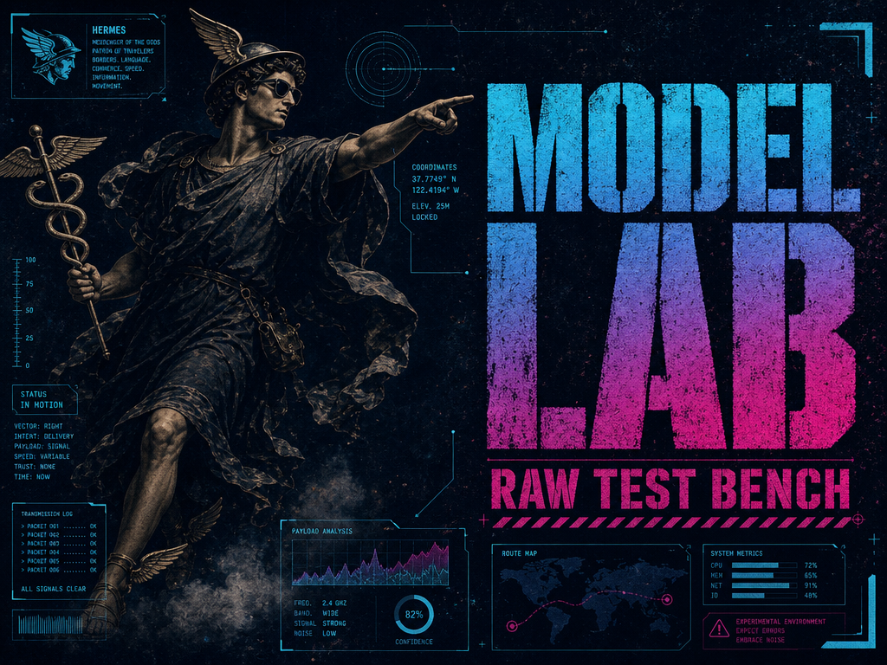

# Hermes Model Lab




A stateless model playground for Hermes Desktop.

Hermes Model Lab is an opt-in Desktop plugin for testing prompts against configured models without turning each run into a Hermes conversation. Lab runs must not write to Hermes chat history, memory, skills, project files, or model settings.

## Version 0.1.0

| Capability | 0.1.0 |
|---|---|
| Right-side Hermes Desktop pane | Validated |
| Single-prompt model runs | Backend + Desktop validated |
| Provider and model selection | Backend + Desktop validated |
| Response time and token usage | Backend + Desktop validated |
| Cancel and clear controls | Validated |
| State isolation proof | Proven by `scripts/verify_isolation.py` |
| Hermes tools or agent loops | Excluded |
| Code execution | Excluded |
| Saved conversations | Excluded |

## Safety promise

The first release is a model lab, not a general security sandbox. It makes one bounded model request at a time, keeps credentials in Hermes, disables tools, and avoids Hermes session and memory storage. Code execution will not be added unless it can run behind a proven container boundary.

## Status

The stateless model path is validated from the Hermes Desktop pane through the bounded backend. A real Electron QA run sent a prompt, rendered the answer and model identity, blocked duplicate runs, discarded a late response after Cancel, cleared prompt and result state, and enabled and disabled the plugin cleanly. Provider and model selection is now validated end to end at the contract level: the pane lists only configured providers and models from a sanitized host inventory projection, picks are fail-closed against that inventory before any model call, and the Hermes active model plus all credentials stay untouched.

Response facts are shown without guessing: each result card reports the completion state, the requested provider and model (the caller's explicit selection, labeled Requested), and the authoritative served provider and model returned by the host (labeled Served). A host alias may serve a different model than requested; both identities are always labeled explicitly and the served identity is never called selected. The card also reports measured elapsed time, and token usage exactly as reported. When a provider returns no usage (or only an empty placeholder), the card shows Unavailable rather than zeros, and cost appears only when the host returns a real number. Rate-limited runs get their own fixed message, detected from status metadata only; all provider error details stay out of the renderer.

The full isolation proof is reproducible. Run one real bounded lab request with:

```
python scripts/verify_isolation.py --hermes-home <hermes-home> --project-root <project>
```

It snapshots semantic session and message totals, hashes config, memory, skill, cron, session metadata, and project source files (never credentials), searches message storage and logs for a unique synthetic marker before and after the request, and exits nonzero if anything changed or the marker leaked anywhere. The shipped request schemas carry no path, file, tool, code, exec, shell, or command fields, and static checks keep credential readers and filesystem, tool, and code-execution actions out of the plugin source.

## Topology verification

The three supported topologies are proven by one reusable script:

```
python scripts/verify_topology.py --project-root <project>
```

Local disposable install: installs and enables both plugin halves into a temporary Hermes home (never overwriting), runs Plugin Doctor on the installed copy, checks exact source parity over the shippable file set, verifies the Desktop entry's syntax, inventories the plugin router's routes, exercises health and model payloads through a bare unauthenticated client, then uninstalls and proves nothing remains.

Windows-to-WSL path contract: resolves the Windows username from the WSL mount by reading directory names only, derives the expected `%LOCALAPPDATA%\hermes\desktop-plugins\hermes-model-lab\plugin.js` path where the folder id equals the plugin id, pins the backend to the WSL Hermes home, and proves no-overwrite install planning plus refusal to uninstall unknown folders — all inside a temporary fake Windows root. No Windows OS setting is touched.

Remote/OAuth contracts: the Desktop SDK's `ctx.rest` is profile-aware and namespace-scoped, `ctx.socket` resolves to a no-op on OAuth remotes, and Model Lab polls its backend over REST only.

A read-only probe of the live WSL desktop bridge confirms the service is active, port 9119 listens on loopback, and an unauthenticated request to the plugin route answers 401 — proving the route is mounted behind the dashboard auth gate without ever reading a token. The script exits nonzero on any parity, path, route, or cleanup failure and prints a JSON receipt listing every removed temporary path.

## Install, use, uninstall (version 0.1.0)

The release archive extracts to a single `hermes-model-lab-0.1.0/` folder.

Install the backend half: copy that folder into your Hermes plugins directory (`~/.hermes/plugins/hermes-model-lab` on Linux/WSL) and add `hermes-model-lab` under `plugins.enabled` in your Hermes `config.yaml`.

Install the Desktop half (Windows): copy the same folder's contents to `%LOCALAPPDATA%\hermes\desktop-plugins\hermes-model-lab\`, so that `plugin.js` sits directly inside that folder.

Do not overwrite an existing installation. Copy into empty target folders only, and remove an older Model Lab installation before installing this release.

Use: open Hermes Desktop, enable Model Lab, type one prompt, pick an allowed provider and model, and run. Each result card labels the Requested provider/model you picked and the Served provider/model the host actually answered with — a host alias may serve a different model than requested, so both are always shown separately. Cancel stops waiting for a run, Clear wipes prompt and result state from the pane.

Uninstall: remove the two installed folders listed above and remove `hermes-model-lab` from `plugins.enabled`. Other enabled plugins and unrelated config keys are left untouched.

Supported topologies: local Hermes Desktop with a local backend, Windows Desktop against a WSL backend (Desktop half on Windows, backend half in the WSL Hermes home), and OAuth remotes where the pane polls its backend over REST only.

Isolation limits: lab runs never write to chat history, memory, skills, cron, project files, or model settings, and credentials stay host-owned. V1 has no agent loop, tools, code execution, filesystem access, saved sessions, or memory writes. The first release is a model lab, not a general security sandbox.

## Contributing

Read [CONTRIBUTING.md](CONTRIBUTING.md) before proposing a change.

---

MIT. Do whatever you want with these.

Built by [@BChopLXXXII](https://x.com/BChopLXXXII)

Built for BUILDERS who just want their AI to feel less... corporate.

Ship it. 🚀

If this helped, ⭐ the repo — it helps others find it.
